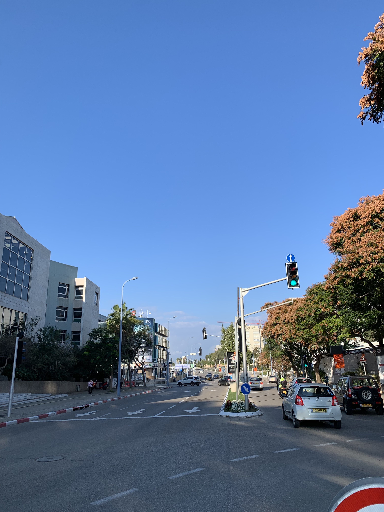

## Markdownとは

[Typoraの使い方](./Typoraの使い方.html)を既に読まれた方は[よく使う記法](#よく使う記法)をお読みください。

### なぜMarkdownを使うのか

Webページを書きたい場合，普通はHTMLと呼ばれるものを使うか，普通のメモ帳などに書いたものをそのまま表示します。ただHTMLは書き方を学ぶのに時間がかかり，またメモ帳に書くのは簡単ですがそのままウェブサイトに載せたら画像やリンクを入れられません。

そこで二つの中間地点としてMarkdownという書き方を使います。詳しくは[よく使う記法](#よく使う記法)を読んでいただくとして，とりあえず[Typora](https://typora.io/)や[Type](https://itunes.apple.com/jp/app/type-simple-markdown-editor/id1214613873?l=en#?platform=iphone)，[Dillinger](https://dillinger.io/)(「[Typoraの使い方](./Typoraの使い方.html)」を参照)などで作った新しいファイルに以下の四角に囲まれたテキストをコピペしてみてください。

```markdown
# タイトル
### サブタイトル
##### 小見出し

\#+半角スペース を書くと勝手にタイトルになる。\#増やせば文字が小さくなる。


- 左のように'-'+半角スペースで
- リストが書ける
1. 数字+'.'で
2. 番号付きリストもかける
<div style="color:red;">HTMLも書きたければかける</div>
<iframe width="560" height="410" src="https://www.youtube.com/embed/oPG2Yw-eVNE" frameborder="0" allow="accelerometer; autoplay; encrypted-media; gyroscope; picture-in-picture" allowfullscreen></iframe>
**Youtubeも表示できる。**
*\*で囲むとイタリック体，\*\*で囲めばボールド体になる*
```

以下のようになるはずです。(スマホでDillingerを使用する場合は右上の目のマークを押します。)

# タイトル

### サブタイトル

##### 小見出し


\# + 半角スペース を書くと勝手にタイトルになる。\#増やせば文字が小さくなる。


- 左のように'-'+半角スペースで
- リストが書ける

1. 数字+'.'で
2. 番号付きリストもかける

<div style="color:red;">HTMLも書きたければかける</div>

<iframe width="560" height="400" src="https://www.youtube.com/embed/oPG2Yw-eVNE" frameborder="0" allow="accelerometer; autoplay; encrypted-media; gyroscope; picture-in-picture" allowfullscreen></iframe>

**Youtubeも表示できる。**

*\*で囲むとイタリック体，\*\*で囲めばボールド体になる*

このように，いくつかの記号を組み合わせることによりページに必要な最低限のレイアウトが組めます。

## よく使う記法

記事を書くときに使いそうなものをまとめました。

パッと確認したいときは[こちら](https://qiita.com/kamorits/items/6f342da395ad57468ae3)，もっと詳しく見たいときは[こちら](https://www.asobou.co.jp/blog/bussiness/markdown)もご参照ください。

###### 目次

[見出し](#見出し)

[イタリック体，ボールド体](#イタリック体，ボールド体)

[リンク](#リンク)

[写真](#写真)

[箇条書き](#箇条書き)

### 見出し

```markdown
# 見出し１
## 見出し２
### 見出し３
#### 見出し４
##### 見出し５
###### 見出し６
```

# 見出し１
## 見出し２
### 見出し３
#### 見出し４
##### 見出し５
###### 見出し６

---

使う記号 :  #

効果 : 見出しを記入できる。またその大きさを調整できる。

文頭に#を記入，そのあとに**半角**のスペースを入れることでその行が見出し(タイトル)になる。

\#の数を多くすると見出しの大きさを6段階まで小さくできる。


### イタリック体，ボールド体

```markdown
*イタリック*  
**ボールド**  
```

*イタリック*

**ボールド**

---

使う記号 : \*

効果 : イタリック体とボールド体を記入できる。

\*で囲むと*イタリック体*，\*\*で囲むと**ボールド体**になる。


### リンク

```markdown
[Google](https://www.google.com/)  
[なぜMarkdownを使うのか](#なぜMarkdownを使うのか)
```

[Google](https://www.google.com/)

[なぜMarkdownを使うのか](#なぜMarkdownを使うのか)

---

使う記号 : \[タイトル]\(URL\)

リンクを表示自体場合，\[リンク先のタイトル\]\(リンク先のURL\)と表示することでリンクを作れます。また，このページ内の見出しについては，URLのところに'#*見出し*'と記入することで，そのページへとぶリンクが作れます。

### 写真

```markdown


```


---

使う記号 : 

効果 : 写真を表示できる。

\!\[*タイトル*\]\(*画像のURL*\)の形で記入すると，URLので動画が表示されます。

ネット上の画像なら(**著作権に問題ないことをよく確認した上で**)そのURLを記入することで表示できます。自分の画像を表示したい場合は，assetsフォルダに画像を保存した上で'*assets/画像の名前* 'と記入してください。

### 箇条書き

```markdown
- 箇条書き
	- tabキーでインデントすれば
	- 自動で記号が変わる
1. 数字つきリストでは
1. 自動で
1. 数字も変わる
```

- 箇条書き
  - tabキーでインデントすれば
  - 自動で記号が変わる
1. 数字つきリストでは
2. 自動で
3. 数字も変わる

---

使う記号 : - または 1.

効果 : 箇条書きを記入できる。

箇条書きを書くときは，- (*でも可)を記入し半角スペースを空けることで箇条書きになる。

1\.で始めれば番号がつき，順番などを表せる。

