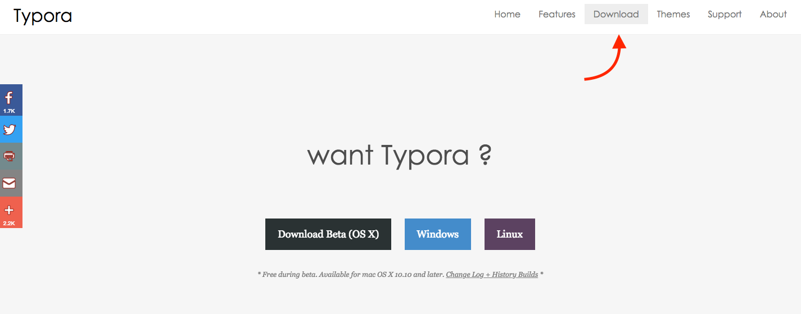
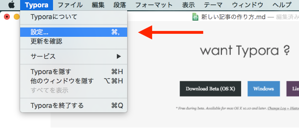
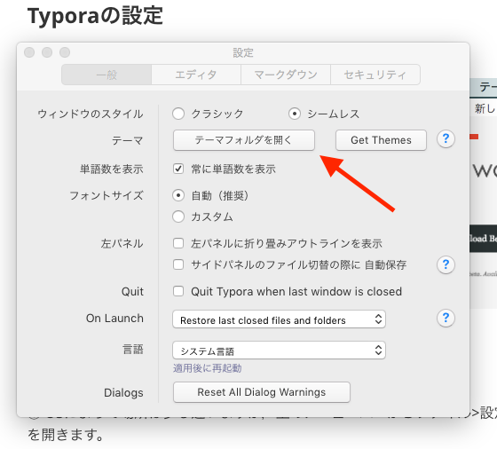
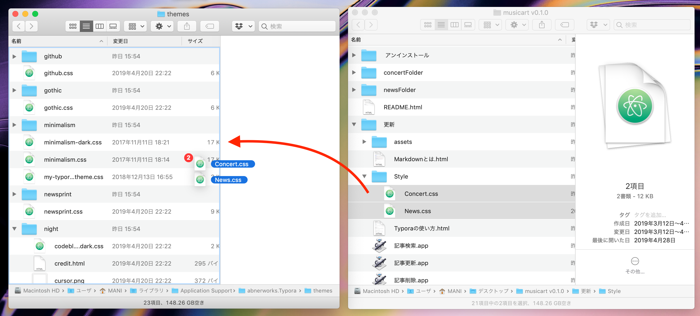
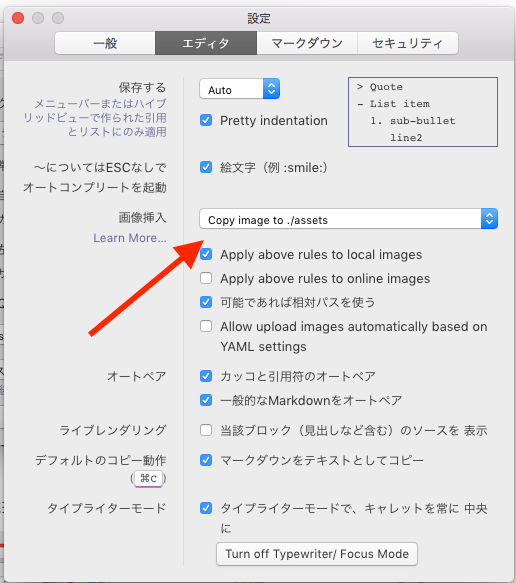
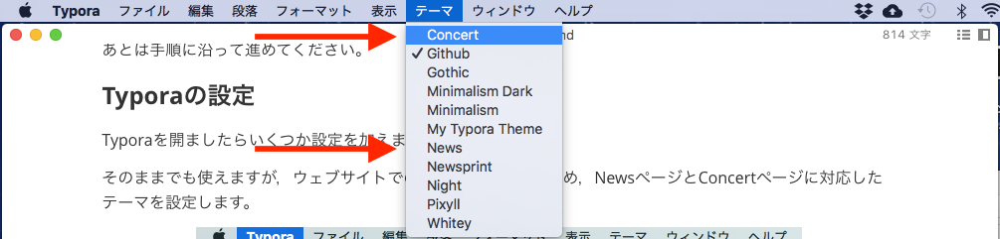

# Typoraの使い方

[ホームへ戻る](../index.html)

### Typoraのダウンロード

記事ごとに書き方とスタイルに一貫性もたせつつ簡単に作成できるようにTyporaというアプリを使おうと思っています。パソコン以外で作業される方は以下のTypeやDillingerなどもご使用ください。使い方は[**Markdownとは**](#Markdownとは)を参考にしてください。

##### iOSアプリ

**Type** https://itunes.apple.com/jp/app/type-simple-markdown-editor/id1214613873?l=en#?platform=iphone

##### ブラウザ上で動くエディタ

**Stackedit** https://stackedit.io/app#

**Dillinger** https://dillinger.io/

#### ダウンロード方法

以下のサイトからTyporaをダウンロードします。(今のところ)無料です。

https://typora.io/

少しスクロールすると出てくる右上のDownloadボタンからダウンロードします。パソコンのOSに合わせて使ってください



あとは手順に沿って進めてください。

### Typoraの設定

Typoraを開けましたらいくつか設定を加えます。

そのままでも使えますが，ウェブサイトでの見た目を再現するため，NewsページとConcertページに対応したテーマを設定します。

① OSによって場所は少し違いますが，上のメニューバーからファイル>設定(macならTypora>設定)で設定画面を開きます。



② 設定画面から「テーマフォルダを開く」を選択します。



③ themesフォルダが開きます。このドキュメントが元々入っていた「更新」フォルダの中から，Styleフォルダを選択し中身を全てthemesフォルダに移します。



④設定画面に戻り，画像挿入のところを'Copy image to ./assets'に設定します。(Windowsの場合は設定方法が少し違うかもしれません)



⑤ ここまでできたら，Typoraを**一度終了し再起動します。**

⑥ メニューバーからテーマを選択し，書きたい記事の種類によってNewsまたはConcertを選択します。



### Markdownとは

Webページを書きたい場合，普通はHTMLと呼ばれるものを使うか，普通のメモ帳などに書いたものをそのまま表示します。ただHTMLは書き方を学ぶのに時間がかかり，またメモ帳に書くのは簡単ですがそのままウェブサイトに載せたら画像やリンクを入れられません。

そこで二つの中間地点としてMarkdownという書き方を使います。とりあえずTypora(もしくはDillinger) で新しいファイルを作り，以下の四角に囲まれたテキストをコピペしてみてください。

```markdown
# タイトル
### サブタイトル
##### 小見出し

\#+半角スペース を書くと勝手にタイトルになる。\#増やせば文字が小さくなる。


- 左のように'-'+半角スペースで
- リストが書ける
1. 数字+'.'で
2. 番号付きリストもかける
<div style="color:red;">HTMLも書きたければかける</div>
<iframe width="560" height="410" src="https://www.youtube.com/embed/oPG2Yw-eVNE" frameborder="0" allow="accelerometer; autoplay; encrypted-media; gyroscope; picture-in-picture" allowfullscreen></iframe>
**Youtubeも表示できる。**
*\*で囲むとイタリック体，\*\*で囲めばボールド体になる*
```

以下のようになるはずです。(スマホでStackEditやDillingerを使用する場合は右上の目のマークを押します。)

# タイトル

### サブタイトル

##### 小見出し


\# + 半角スペース を書くと勝手にタイトルになる。\#増やせば文字が小さくなる。


- 左のように'-'+半角スペースで
- リストが書ける
1. 数字+'.'で
2. 番号付きリストもかける

<div style="color:red;">HTMLも書きたければかける</div>

<iframe width="560" height="410" src="https://www.youtube.com/embed/oPG2Yw-eVNE" frameborder="0" allow="accelerometer; autoplay; encrypted-media; gyroscope; picture-in-picture" allowfullscreen></iframe>

**Youtubeも表示できる。**

*\*で囲むとイタリック体，\*\*で囲めばボールド体になる*

このように，いくつかの記号を組み合わせることによりページに必要な最低限のレイアウトが組めます。

詳しい書き方は「[Markdownとは](./Markdownとは.html)」や以下のサイトなどをご参照ください。

<https://www.asobou.co.jp/blog/bussiness/markdown>

### Typoraの便利な使い方

Typoraで書くときによく使う機能やショートカットです。Mac版で確認していますが，多分他のOSでもできるはずです。問題ありましたらmanimigue0701@gmail.comまでご連絡ください。

詳しくは(英語ですが)[公式サポートサイト](http://support.typora.io/)もご確認ください。日本語でしたら[こちら](https://qiita.com/AnchorBlues/items/532dba54cd2f0465af97)や[こちら](https://qiita.com/kenji_shinoda/items/97320dc3f40a4c98df35)のサイトも詳しいです。

###### 目次

[画像挿入](#画像挿入)

[ショートカット](#ショートカット)

#### 画像挿入

画像の挿入方法には色々あります。注意する点としては，自分の画像の場合，assetsフォルダ内の画像しかウェブサイトにアップロードされません。[Typoraの設定](#Typoraの設定)④をしてあれば自動でassetsフォルダにコピーされるのでこれをお勧めします。

1. **ドラッグ&ドロップ**

   画像を挿入したい箇所にドラッグ&ドロップ

   <iframe width="560" height="450" src="https://www.youtube.com/embed/X16uwgThWUE" frameborder="0" allow="accelerometer; autoplay; encrypted-media; gyroscope; picture-in-picture" allowfullscreen></iframe>

2. **Markdown形式で記述する**

   !\[タイトル\]\(URL\)と書くことにより，画像を表示することができます。ドラッグ&ドロップはこの記述を自動でやってくれるだけで，やっていることは同じです。

3. **メニューバーから，編集>画像ツールから画像の挿入，設定を行う**

   より詳しい設定が行えます。

#### ショートカット

詳しくは[公式サイト](<http://support.typora.io/Shortcut-Keys/>)へ

| 機能            | Widows/Linux     | Mac                 |
| ------------------- | ---------------- | ------------------- |
| セーブ               | Ctrl + S         | Command + S         |
| 名前をつけて保存 / 複製 | Ctrl + Shift + S | Command + Shift + S |
| 見出し1~6          | Ctrl + 1~6         | Command + 1~6     |
| 検索          | Ctrl + F         | Command + F      |
| 設定          | Ctrl + ,         | Command + ,         |
| ボールド体 | Ctrl + B | Command + B |
| イタリック体 | Ctrl + I | Command + I |
| 下線 | Ctrl + U | Command + U |
| リンク | Ctrl + K | Command + K |

