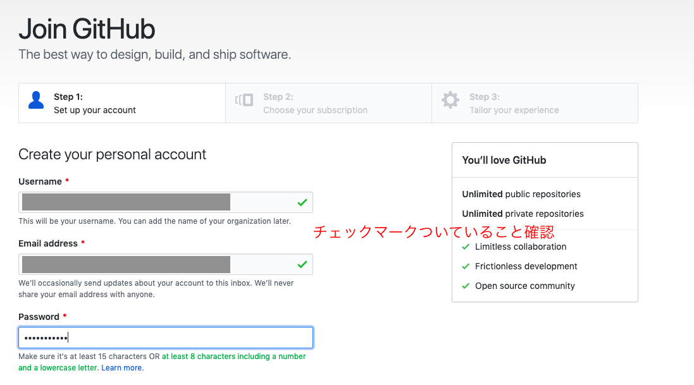
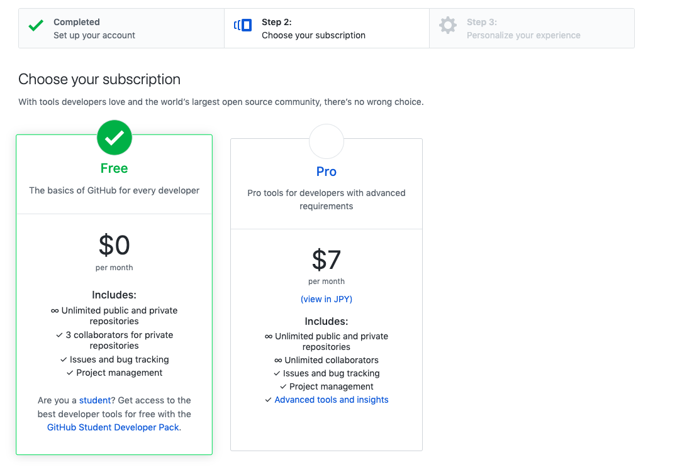
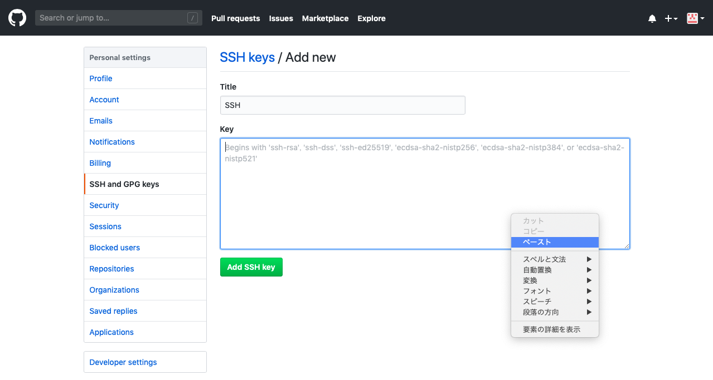

## 初期設定

[ホームへ戻る](../index.html)

(現在,Xcodeがない場合でも動作するか確認中です。問題が発生しましたらmanimigue0701@gmail.com までご連絡ください。)

1. GitHubに登録

   <https://github.com/join> にてGitHubに登録します。既に登録してある方は飛ばしてください。

   1. ユーザーネーム，メールアドレス，パスワードを設定

      

      

   2. Freeのアカウントを選択

      

      

   3. いくつか質問に答える(スキップ可)

   4. アカウント確認メールが届くので，「Verify email address」を押して登録を終える。

2. GitHubアカウント設定

   1. 初期設定フォルダ内の「設定１.app」を起動し，指示に従ってGitHubの情報を設定します。

      セキュリティを保証するため，SSH-KEYを登録

   2. 「SSH-KEYがコピーされました」と表示されたら，そのSSH-KEYをGitHubに登録します。

      1. https://github.com/settings/ssh/new にてSSH-KEYを登録します。

         既にSSH-KEYはコピーされているので，Key欄にペーストしてください。Titleは'SSH'など，適当で構いません。

         

         

      2. 「Add SSH key」を押して登録を完了します。

   3. GitHubに必要な設定は一旦これで終わりです。管理者からメールで返信があるまでお待ちください。

3. ウェブサイト情報をダウンロードします。

   1. 編集者として登録を行います。管理者 manimigue0701@gmail.com からメールの返信があるまで，お手数ですが少々お待ちください。

   2. 管理者から設定が完了したメールが届きましたら，メール内のリンクから編集者登録を完了してください。

   3. 最後に，「設定２.app」を起動し指示に従って入力していってください。

      設定が完了すると，問題なく動くかテストが行われます。その結果が自動的にメールに記入されるので，その内容を確認後送信してください。

### 設定完了

ここまで終われば全ての設定は完了です！

記事の更新には更新フォルダ内の「[新しい記事の作り方](../更新/新しい記事の作り方.html)」を参照してください。